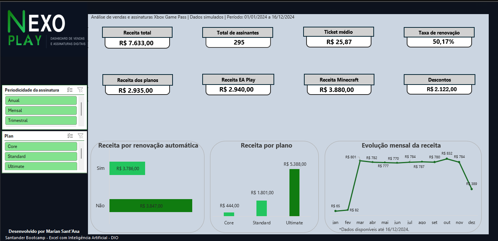
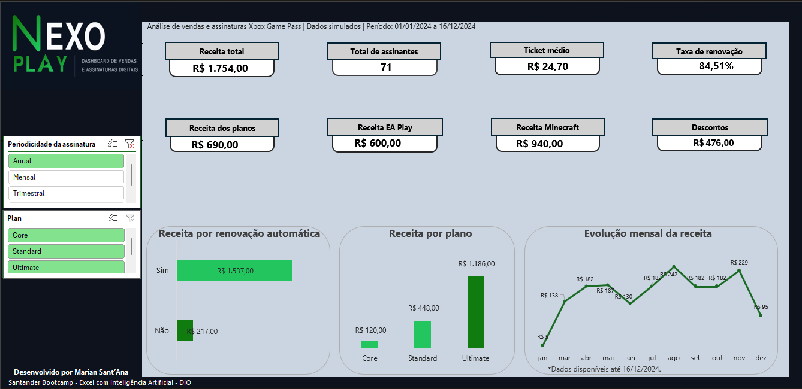
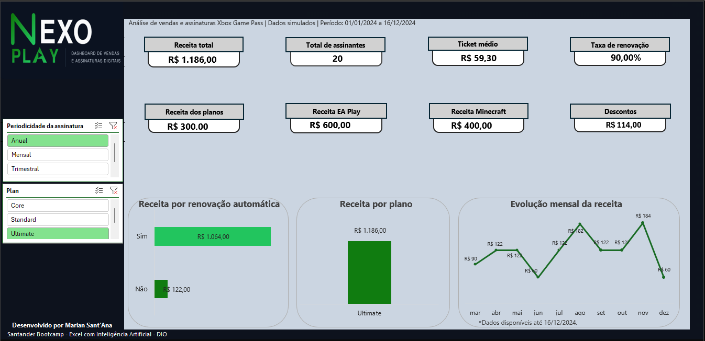
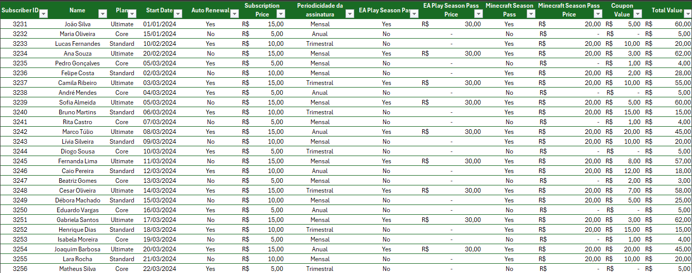
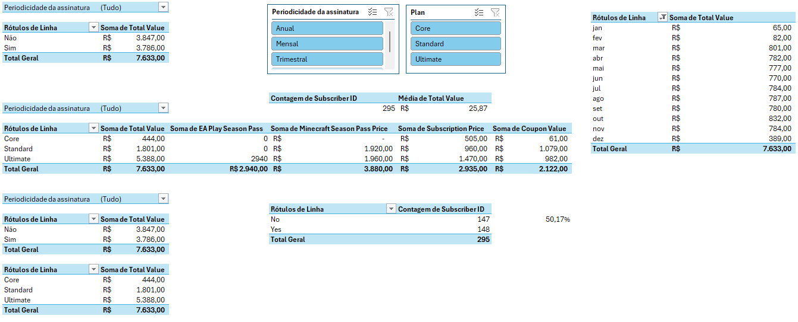

# NEXO PLAY

Dashboard interativo de vendas e assinaturas digitais desenvolvido no Microsoft Excel.

## Sobre o projeto

O NEXO PLAY foi desenvolvido como parte de um desafio do Santander Bootcamp Excel com Inteligência Artificial, realizado pela DIO.

A proposta inicial era criar um dashboard de vendas a partir de uma base de assinaturas do Xbox Game Pass. Durante o desenvolvimento, procurei ir além da organização dos dados e construir uma identidade visual própria para o projeto.

Foi assim que surgiu o NEXO PLAY: um dashboard pensado para reunir as principais informações da base de maneira simples, visual e fácil de explorar.

Esse projeto teve um significado especial para mim porque representa mais uma etapa da minha transição para a área de dados. Cada cálculo, filtro e ajuste visual foi uma oportunidade de aprender melhor como transformar uma base de dados em informações que realmente ajudam na análise.

> Os dados utilizados são simulados e destinados exclusivamente ao aprendizado.

## Objetivo

O objetivo do projeto foi desenvolver um dashboard capaz de responder às principais perguntas sobre as vendas e assinaturas:

* Qual foi a receita total?
* Quantos assinantes estão presentes na base?
* Qual é o ticket médio?
* Qual é a taxa de renovação automática?
* Quanto cada plano representa na receita?
* Qual foi a receita obtida com EA Play e Minecraft?
* Qual foi o valor total concedido em descontos?
* Como a receita se comportou ao longo dos meses?

## Indicadores apresentados

O dashboard reúne os seguintes indicadores:

* Receita total;
* Total de assinantes;
* Ticket médio;
* Taxa de renovação automática;
* Receita dos planos;
* Receita do EA Play;
* Receita do Minecraft;
* Total de descontos.

A receita total foi calculada considerando os valores dos planos e dos adicionais, com a dedução dos cupons de desconto.

O ticket médio representa a média do valor final pago pelos assinantes. A taxa de renovação corresponde à quantidade de assinantes com renovação automática ativa em relação ao total de assinantes apresentado pelos filtros.

## Funcionalidades

* Segmentação por periodicidade da assinatura;
* Segmentação por tipo de plano;
* Indicadores atualizados de acordo com os filtros;
* Análise da receita por renovação automática;
* Comparação da receita entre os planos;
* Evolução mensal da receita;
* Organização da base em tabela estruturada;
* Cálculos realizados com tabelas dinâmicas;
* Identidade visual própria criada para o projeto.

## Visão geral

Na visualização principal, o dashboard apresenta os resultados consolidados de todas as assinaturas.

## Análise por periodicidade

Os indicadores e gráficos podem ser filtrados pela periodicidade da assinatura. No exemplo abaixo, estão selecionados apenas os planos anuais.

## Combinação de filtros

Também é possível combinar os filtros de periodicidade e plano. Esta visualização apresenta somente as assinaturas anuais do plano Ultimate.

## Base de dados

A base contém informações como identificação do assinante, plano, data de início, renovação automática, periodicidade, adicionais, cupons de desconto e valor total.

## Cálculos e tabelas dinâmicas

As informações apresentadas no dashboard são alimentadas por tabelas dinâmicas conectadas às segmentações de dados.

Essa estrutura permite que os indicadores e gráficos sejam atualizados quando uma nova seleção é realizada.

## Ferramentas e recursos utilizados

* Microsoft Excel;
* Tabelas estruturadas;
* Tabelas dinâmicas;
* Gráficos dinâmicos;
* Segmentações de dados;
* Fórmulas e campos calculados;
* Organização e tratamento de dados;
* Design aplicado a dashboards.

## Estrutura da planilha

A pasta de trabalho foi organizada nas seguintes abas:

* **Dashboard:** visualização principal e filtros;
* **Cálculos:** tabelas dinâmicas e indicadores;
* **Bases:** dados utilizados na análise;
* **Assets:** elementos de apoio e identidade visual.

## Como utilizar

1. Faça o download do arquivo `nexo-play-dashboard.xlsx`;
2. Abra o arquivo no Microsoft Excel;
3. Acesse a aba **Dashboard**;
4. Utilize os filtros localizados no lado esquerdo;
5. Selecione uma periodicidade, um plano ou combine os dois filtros;
6. Para voltar à visualização geral, clique no ícone de limpar filtro.

## Download

[Baixar o dashboard NEXO PLAY](./nexo-play-dashboard.xlsx)

## Aprendizados

Durante esse projeto, consegui praticar a criação e a conexão de tabelas dinâmicas, o desenvolvimento de indicadores, o uso de segmentações e a construção de gráficos que respondem aos filtros.

Também aprendi que um dashboard não depende apenas dos cálculos. A organização, a escolha dos indicadores e a forma como as informações são apresentadas interferem diretamente na compreensão dos dados.

O resultado foi um projeto mais completo, com uma identidade que representa meu processo de aprendizado e a construção do meu portfólio na área de dados.

## Autoria

Desenvolvido por **Marian Sant’Ana** durante o **Santander Bootcamp Excel com Inteligência Artificial**, promovido pelo Santander Open Academy em parceria com a DIO.

## Aviso

Este é um projeto educacional, independente e não oficial. Os dados são simulados. Xbox, Xbox Game Pass, EA Play e Minecraft são marcas de seus respectivos proprietários. O projeto não possui vínculo comercial ou institucional com essas empresas.
